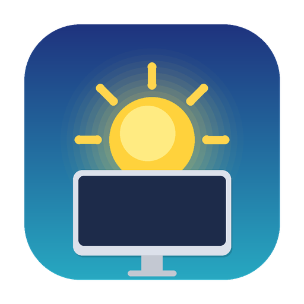

# DDC Monitor

macOS menu bar app for controlling Dell external monitor brightness & contrast via DDC/CI.

Built for Apple Silicon Macs with USB-C/Thunderbolt connected Dell monitors. Pure Swift — no external runtime dependencies.



## Features

- **Menu bar sliders** — Adjust brightness and contrast from the menu bar
- **Global hotkeys** — Fn+F1/F2 to adjust brightness & contrast simultaneously
- **Smart display targeting** — Mouse cursor position determines which display to control (DDC for external, passthrough for built-in)
- **Tahoe-style OSD** — Native floating overlay shows current level on hotkey use
- **Day/Night presets** — One-click presets with long-press to save current values
- **Launch at Login** — Toggle from the menu bar; uses macOS native login items

## Requirements

- macOS 14.0+
- Apple Silicon Mac
- Dell external monitor via USB-C or Thunderbolt
- Accessibility permission (for global hotkeys)

## Install

```bash
git clone https://github.com/rikutoe/dell-monitor-ddc.git
cd dell-monitor-ddc
./Scripts/build-app.sh
cp -R .build/release-app/DDCMonitor.app /Applications/
```

Then open **DDC Monitor** from `/Applications` and grant Accessibility permission when prompted.

## Build

```bash
# Release build + .app bundle
./Scripts/build-app.sh

# Development build
swift build
```

## Architecture

```
Sources/
  DDCMonitor/              # Menu bar app (SwiftUI)
    App.swift              # MenuBarExtra entry point
    MenuBarView.swift      # Sliders, presets, launch-at-login toggle
    BrightnessEngine.swift # Adjustment logic + value persistence
    HotkeyManager.swift    # CGEvent tap for global F1/F2
    CursorRouter.swift     # Cursor → screen detection
    OSD{Window,View,Manager}.swift  # Floating OSD overlay
    SettingsStore.swift    # UserDefaults wrapper
  DDCControl/              # Native DDC/CI library
    DDCDisplay.swift       # Display enumeration + VCP read/write
    DDCPacket.swift        # DDC packet construction + checksum
    IOAVServiceBridge.swift # Private API via @_silgen_name
```

## Key Design Decisions

| Decision | Rationale |
|---|---|
| Write-only DDC (in-memory tracking) | DDC reads are unreliable on Apple Silicon |
| IOAVService via `@_silgen_name` | Direct DDC access without external tools |
| CGEvent tap for hotkeys | System-wide F1/F2 interception with passthrough |
| NSPanel for OSD | Floating window without private OSD APIs |

## License

MIT
